# CONNECT (Find Experts For Podcasts)

## Repository

https://github.com/behzad17/podcast-experts-backend

A full-stack web application for discovering, sharing, and managing contact between podcasters and experts. The platform provides a convenient and reliable way for experts and specialists to connect with podcasters and content creators.

- **Backend:** Django + Django REST Framework
- **Frontend:** React
- **Deployment:** Single Heroku app serving both API and compiled React build
- **Media:** Cloudinary for images and profile pictures

---

## Table of Contents

- [Project Overview](#project-overview)
- [Project Goals](#project-goals)
- [User Stories](#user-stories)
- [Frontend Pages Overview](#frontend-pages-overview)
- [Design & UX](#design--ux)
- [Screenshots](#screenshots)
- [Wireframes](#wireframes)
- [Models Explained](#models-explained)
- [How the Site Works](#how-the-site-works)
- [LO4 – Front-End Interactivity](#lo4--front-end-interactivity--api-integration-distinction-level-summary)
- [Frontend Architecture & React Features](#frontend-architecture--react-features)
- [API Endpoints](#api-endpoints)
- [CRUD Operations](#crud-operations)
- [Environment Variables](#environment-variables)
- [Installation](#installation-local-setup)
- [Deployment](#deployment)
- [Testing](#testing)
- [Project Management](#project-management-agile)
- [Future Improvements](#future-improvements)
- [Contact](#contact)
- [Acknowledgments](#acknowledgments)
- [Conclusion](#conclusion)

## Project Overview

CONNECT is a full-stack platform designed to connect podcasters with experts and specialists across different fields. The application allows users to discover podcasts, explore expert profiles, communicate through messaging, and manage content through a clean, responsive React interface backed by a Django REST API.

The system provides:

- A public directory of podcasts and experts
- Authenticated features such as comments, likes, messaging, and profile management
- Full CRUD functionality for podcasts, expert profiles, and comments
- A modern, mobile-friendly UI with real-time updates through React state
- Centralised media storage using Cloudinary
- A single deployed Heroku application serving both backend API and frontend build

This combination of technologies results in an end-to-end, production-style application that integrates user roles, media, authentication, CRUD operations, and interactive UX.

##  Project Goals

### 1. User-Focused Goals

- Enable visitors to easily browse podcasts and discover experts in different fields.
- Provide a smooth and intuitive experience for creating podcasts, managing expert profiles, commenting, liking, and messaging.
- Ensure users always know their authentication state with a clear and dynamic navbar.
- Deliver consistent feedback through toast notifications, inline validation, and instant UI updates.

### 2. Technical Goals

- Build a modular and maintainable frontend using React, reusable components, and modern JavaScript practices.
- Implement a secure Django REST API with JWT authentication.
- Provide complete CRUD operations across podcasts, experts, comments, likes, messages, and profiles.
- Maintain a clean codebase with separation of concerns between frontend and backend.
- Use GitHub Issues, Milestones and a Kanban board to follow an Agile workflow.

### 3. Accessibility & Responsiveness

- Ensure the interface works seamlessly on mobile, tablet, and desktop.
- Follow WCAG-friendly contrast and typography guidelines.
- Provide accessible form elements, clear focus states and descriptive labels.

### 4. Platform Purpose

- Create a hub where podcasters can publish and present their content.
- Allow experts to showcase their knowledge and be discovered by podcasters who need them.
- Provide a reliable space for direct communication through a built-in messaging system.

## User Stories

The following user stories define the core functionality of the CONNECT platform.  
They are grouped by user type for clarity and follow the standard format:  
**As a [role], I want to [action], so that [benefit].**

---

### Visitor (Unauthenticated User)

- As a visitor, I want to browse podcasts so that I can discover interesting content.
- As a visitor, I want to view expert profiles so that I can learn about their background and expertise.
- As a visitor, I want to view podcast details so that I can understand the content before registering.

---

### 🔹 Registered User

- As a user, I want to register and log in so that I can access member-only features.
- As a user, I want to clearly see when I am logged in so that I understand which actions are available to me.
- As a user, I want to comment on podcasts so that I can share feedback and join discussions.
- As a user, I want to reply to comments so that I can participate in conversations.
- As a user, I want to edit or delete my own comments so that I can correct mistakes.
- As a user, I want to send messages to other users or experts so that I can communicate privately.

---

### 🔹 Podcaster

- As a podcaster, I want to create new podcasts so that I can share my content with others.
- As a podcaster, I want to edit my podcasts so that I can update information when necessary.
- As a podcaster, I want to delete my podcasts so that I can manage my content effectively.
- As a podcaster, I want others to comment and interact with my podcast so that engagement increases.

---

### 🔹 Expert

- As an expert, I want to create a detailed expert profile so that podcasters can discover me.
- As an expert, I want to update my expertise, bio, and social links so that my information remains accurate.
- As an expert, I want to receive messages from users so that I can connect with podcasters who need my skills.

---

### 🔹 Admin (Django Admin)

- As an admin, I want to manage users, podcasts, experts, comments and messages so that the platform remains safe and functional.
- As an admin, I want visibility of all entries so that I can troubleshoot issues and moderate content.

---

These user stories form the basis of the platform’s features and guided the design, development, and testing of the CONNECT application.

## Frontend Pages Overview

The React frontend consists of several pages and components that work together to provide a smooth, interactive experience for both visitors and authenticated users. Each page communicates with the Django REST API via Axios and updates the UI using React state.

---

### 🔹 Public Pages

#### **Home / Podcasts List**

- Displays all podcasts in a responsive card layout.
- Supports category filtering and keyword search.
- Fetches data from `/api/podcasts/` and updates instantly when filters change.

#### **Podcast Detail**

- Shows full podcast information including image, description, category and link.
- Includes comments, replies, likes actions.
- Interactive features (comment, like, reply, edit, delete) are all connected to the API.

#### **Experts List**

- Lists all expert profiles.
- Supports category-based filtering.
- Fetches from `/api/experts/`.

#### **Expert Detail**

- Displays an expert’s bio, expertise areas, social links and profile picture.
- Allows users to send a message directly to the expert.

#### **About & Contact Pages**

- Provides background information and a contact form.
- Contact form sends data to the backend and shows confirmation toasts.

---

### 🔹 Authentication Pages

#### **Login**

- Validates credentials and sends POST request to `/api/auth/login/`.
- On success: stores tokens, updates navbar and redirects user.

#### **Register**

- Contains validation (password match, strong password, required fields).
- Creates a new user via `/api/auth/register/` and logs them in automatically.

---

### 🔹 User Pages

#### **Profile Page**

- Displays the user’s information (role, email, profile details).
- Includes the **Profile Edit Modal**, allowing updates to bio, links, categories and profile picture.

#### **My Podcasts / My Profile**

- Podcasters see a list of their own podcasts with edit/delete actions.
- Experts see buttons to manage their expert profile.

---

### 🔹 Content Creation / Editing Pages

#### **Podcast Create / Edit**

- Forms for podcasters to create or update podcasts.
- Includes inline validation for required fields and URL format.
- On submission: sends data via POST/PUT and updates UI instantly.

#### **Expert Profile Create / Edit**

- Allows experts to build a rich profile with categories, links and images.
- Validates input and uploads profile pictures to Cloudinary.

---

### 🔹 Messaging System

#### **Inbox (Messages List)**

- Displays all message threads fetched from `/api/messages/`.
- React polling keeps messages updated without page reloads.

#### **Conversation View**

- Chat-like layout showing messages between two users.
- Allows sending new messages via POST and updates messages instantly.
- Shows toast notifications for success and errors.

---

All pages are built with reusable components, React hooks, Axios integration and responsive layout, supporting LO4 for interactive front-end development.

## Design & UX

### Design Process & File Locations

The design of the CONNECT / Podcast Experts platform followed a user-centred process:

1. **Research & Planning**

   - Analysed common patterns in podcast and expert platforms.
   - Defined user types (Visitor, Podcaster, Expert, Admin).
   - Mapped key user journeys and use cases.

2. **Wireframing**

   - Low-fidelity wireframes were created for all main pages.
   - These guided layout decisions and UX flows.

3. **Layout & Components**
   - Reusable components for cards, forms, modals, and navigation.
   - Mobile-first responsive design.

**Documentation locations:**

- **Wireframes:**  
  `docs/design/wireframes/`

- **Design Document (PDF):**  
  `docs/design/podcast_design_document_updated.pdf`

---

### Colour Palette

| Purpose              | Colour     | Hex       |
| -------------------- | ---------- | --------- |
| Primary Background   | Dark Gray  | `#1E1E1E` |
| Primary Text         | White      | `#FFFFFF` |
| Accent / Action      | Blue       | `#007BFF` |
| Secondary Background | Light Gray | `#F5F5F5` |
| Success              | Green      | `#28A745` |
| Error                | Red        | `#DC3545` |

Goals:

- WCAG-friendly contrast
- Clear call-to-action elements
- Professional, focused look

---

### Typography

- **Primary Font:** `Inter`, fallback `Arial, sans-serif`
- **Headings:** 600–700 weight, clear hierarchy
- **Body Text:** 400 weight for readability
- **Buttons & Labels:** Slightly bolder (500–600)

Spacing and readability:

- Consistent vertical spacing between sections
- Comfortable padding around cards and forms
- Minimum 16px base font size

---

### UX Enhancements

To improve user experience beyond basic functionality:

- **Toast notifications** using `react-toastify` for all major actions (create/edit/delete/comment/message).
- **Inline form validation** with clear error messages and disabled submit buttons when input is invalid.
- **Automatic modal closing** after successful actions (e.g. profile update, podcast edit via modal).
- **Instant UI updates** via React state (no full page reloads).
- **Clear login state** through a user dropdown: “Hi, username” with links to Profile, My Podcasts/Profile, Create, Messages, Admin (if applicable), and Logout.
- **Responsive navigation** with a hamburger menu that auto-closes after selection on mobile.

These decisions directly address previous feedback about UX clarity and user feedback.

---

## Screenshots

### Website in Devices (Responsive Overview)

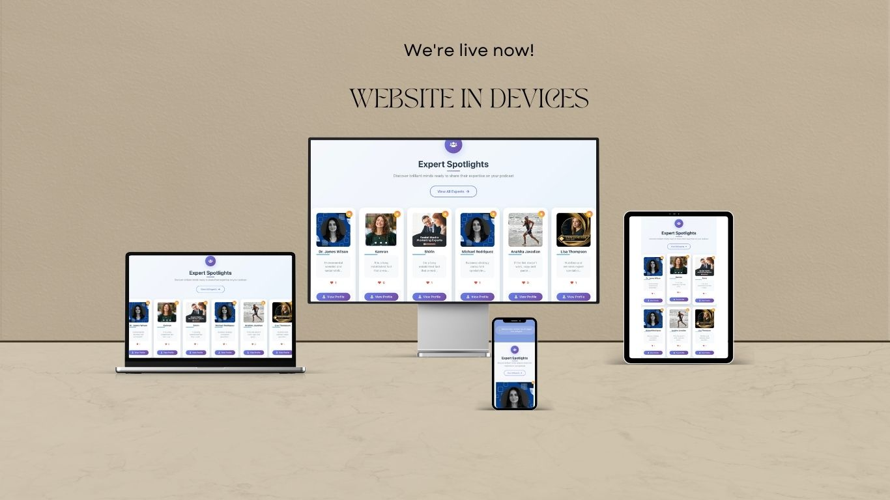  
Shows the CONNECT interface displayed on desktop, tablet and mobile devices.

### Home Page

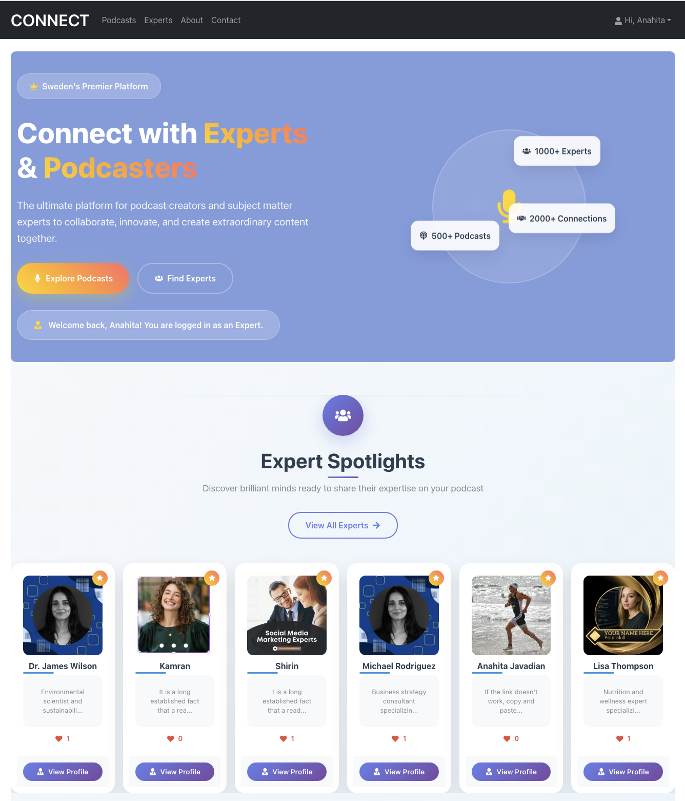  
Shows the main podcasts list with category filters, search, and responsive card layout.

### Podcast Detail

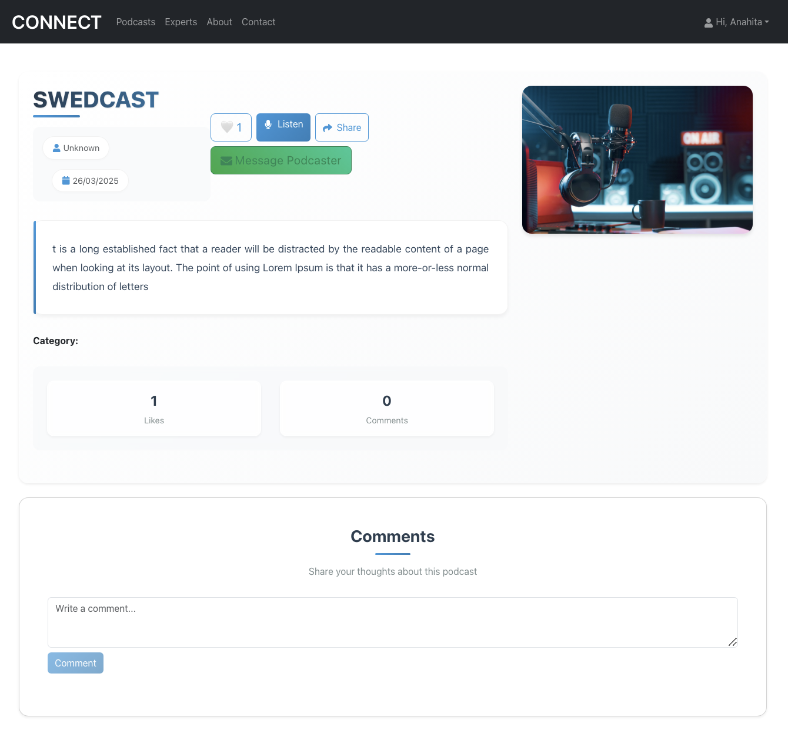  
Displays a single podcast with comments, likes, and CRUD operations for comments (edit/delete for the owner).

### Desktop – Expert Detail

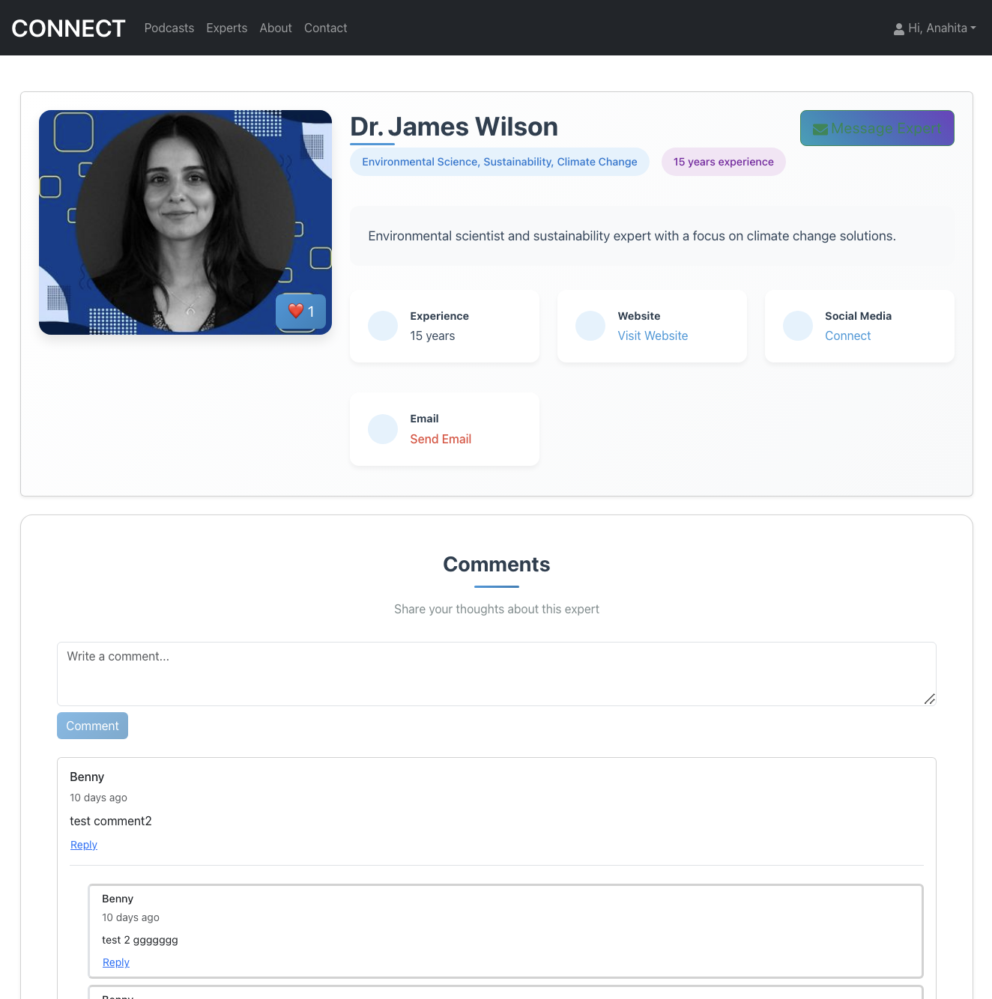

### Admin Panel

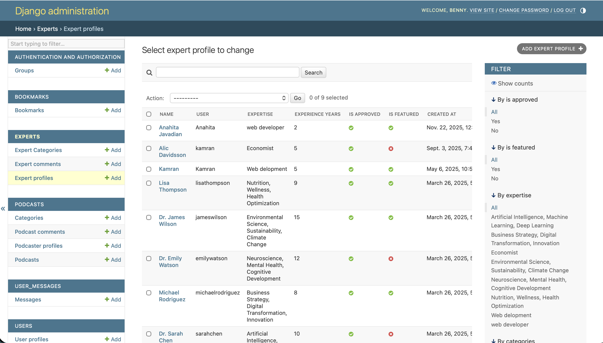  
Demonstrates Django Admin managing podcasts, experts and users, and verifies that data from the React frontend is correctly stored.

### Mobile Navigation

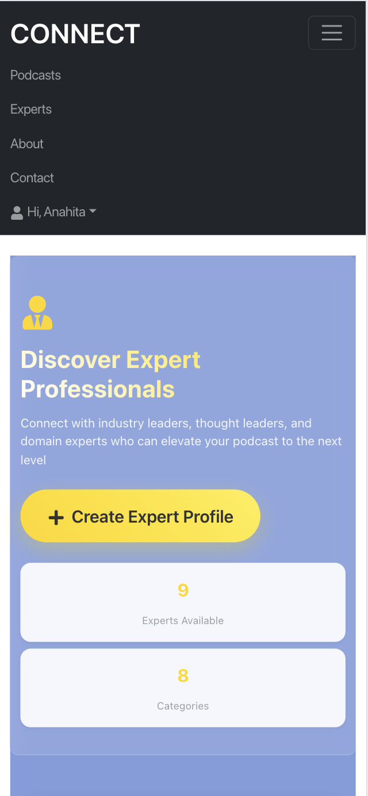  
Shows the responsive navbar and hamburger menu, with login-aware links and mobile-friendly navigation.

### Mobile – Home Page

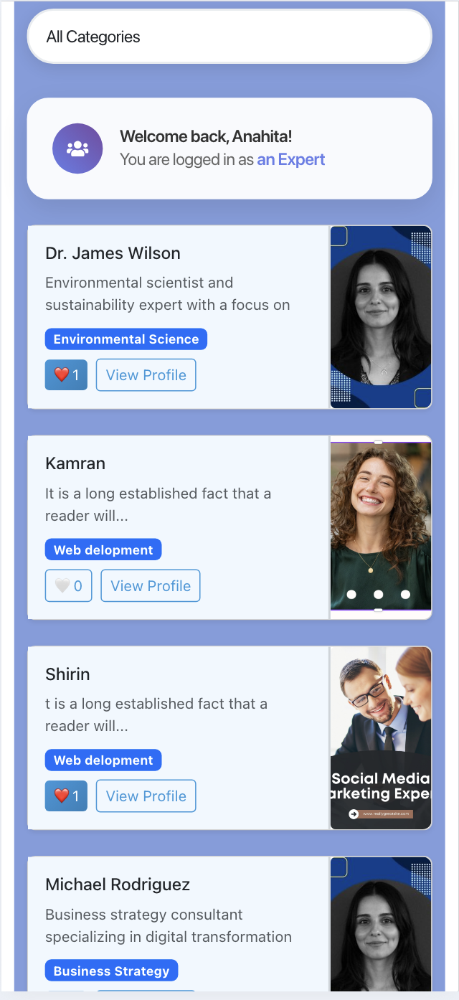

## 🗂 Wireframes

Low-fidelity wireframes were created early in the design process to define layout, navigation flow, and key interactions before building the React frontend.

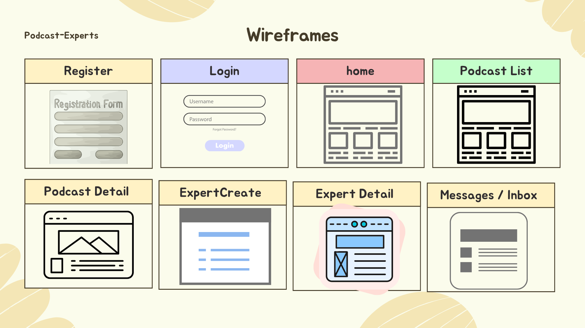

These wireframes cover the core user journeys:

- **Home / Podcast List** – card layout, search area, category filters
- **Registration / Login** – simple input flow with clear labels
- **Podcast Detail** – image, description, comments section and action buttons
- **Expert Create / Expert Detail** – fields for bio, links, categories and profile image
- **Messages / Inbox** – two-column chat layout with thread list + active conversation
- **Contact Page** – form structure and supporting content

These wireframes guided the structure, spacing, and interactive elements now present in the final React UI and directly support LO2 (design choices) and LO4 (frontend behaviour).

## Models Explained

Below is an overview of the main Django models powering the CONNECT platform.  
Each model includes its purpose, key fields and the CRUD operations supported via the REST API.

---

### 1. `CustomUser`

The system uses a fully custom user model extending Django’s `AbstractUser`.

**Purpose:**  
Authentication, user identity, and role handling (listener, podcaster, expert, admin).

**Key Features:**

- JWT authentication (login/register/logout)
- Roles determine access (e.g., only podcasters can create podcasts)
- Auto-linked to profile models (PodcasterProfile / ExpertProfile)

**CRUD:**

- Create (via registration)
- Read (profile page)
- Update (profile edit modal)
- Delete (not exposed to users)

---

### 2. `PodcasterProfile`

Linked one-to-one with `CustomUser`.

**Purpose:**  
Holds extra information for users who create podcasts.

**Fields:**

- Bio, website, social links
- One-to-one `user` field

**CRUD:**

- Read (Profile page)
- Update (Profile Edit Modal)

---

### 3. `ExpertProfile`

One of the central models in the platform.

**Purpose:**  
Allows experts to showcase their experience and be discovered by podcasters.

**Fields:**

- Bio, expertise areas
- Website, LinkedIn, social links
- Profile image (stored in Cloudinary)
- Categories (many-to-many)
- Featured flag
- One-to-one with `CustomUser`

**CRUD:**

- Create (expert profile setup)
- Read (experts list + detail page)
- Update (Profile Edit Modal)
- Delete (optional—API supports it)

---

### 4. `Category`

A shared model used for both Podcasts and Experts.

**Purpose:**  
Enables filtering and discovery by domain or topic.

**Fields:**

- `name` (unique)
- Many-to-many links to podcasts and expert profiles

**CRUD:**

- Admin-only (not editable by users)

---

### 5. `Podcast`

The core content model.

**Purpose:**  
Represents a podcast entry created by a podcaster.

**Fields:**

- Title, description, external link
- Category (foreign key)
- Image (Cloudinary upload)
- `owner` (the podcaster)
- Boolean flags: `featured`, `approved`
- Timestamps

**CRUD:**

- Create (podcasters only)
- Read (public list + detail)
- Update (owner only — via Podcast Edit Modal)
- Delete (owner only)

---

### 6. `PodcastComment`

Supports comments + threaded replies.

**Purpose:**  
Enable community interaction on podcast pages.

**Fields:**

- Text
- Author (user)
- Parent comment (for replies)
- Podcast (foreign key)
- Timestamps

**CRUD:**

- Create (logged-in users)
- Read (podcast detail page)
- Update (owner only)
- Delete (owner only)

---

### 7. `PodcastLike`

Tracks which user liked which podcast.

**Purpose:**  
Like/unlike functionality and like counts.

**Fields:**

- User
- Podcast

**CRUD:**

- Create (like)
- Delete (unlike)

### 8. `UserMessage`

This model powers the messaging system.

**Purpose:**  
Allow users and experts to communicate privately.

**Fields:**

- Sender
- Receiver
- Text content
- Timestamp
- Conversation key (optional/thread grouping)

**CRUD:**

- Create (sending a message)
- Read (inbox + conversation threads)
- Update: not allowed (messages immutable)
- Delete: not implemented (kept for history)

### Bookmark Model (Feature Under Development)

Within the database schema there is a `Bookmark` model intended to let users save podcast entries or expert profiles for quick access later. The table includes references to the user, the podcast and the expert, and it is designed to power bookmarking functionality across the platform.

> **Current status:** In the present release this model exists in the backend but there are no API endpoints or frontend interface to use it. Bookmarking podcasts or experts is therefore **not yet available**, and this capability is earmarked for a future development phase.

## How the Site Works

The CONNECT platform follows a clear end-to-end flow, combining a Django REST API backend with an interactive React frontend.

### 1. Users & Roles

There are three main user types:

- **Visitors:** Can browse podcasts and expert profiles.
- **Registered Users:** Can comment, like, message, create podcasts (if set as podcaster).
- **Experts:** Can create/edit an expert profile and receive messages from podcasters and listeners.

### 2. React Frontend → Django REST API

The frontend communicates with the backend exclusively through REST API calls using Axios.  
Every interactive action triggers an API request:

- Fetch podcasts and experts
- Submit login/register forms
- Create/edit/delete podcasts
- Create/edit/delete comments
- Like/unlike a podcast
- Send messages and load conversations
- Update user or expert profiles (via modals)

Responses from the API immediately update the UI using React state, keeping the interface dynamic without full page reloads.

### 3. Authentication Flow

- When a user logs in, the backend returns **JWT access + refresh tokens**.
- Axios interceptors automatically attach tokens to protected requests.
- The navbar updates to show a login-aware dropdown (`Hi, username`), improving clarity of authentication state.

### 4. Media Handling (Cloudinary)

- Podcast images and expert profile pictures are uploaded through the API.
- Django handles uploads using a custom Cloudinary storage backend.
- The frontend receives and displays Cloudinary URLs instantly after any update.

### 5. Messaging System

- Users can open their inbox and see all conversations.
- Selecting a conversation loads its message thread.
- Sending a message triggers a POST request and updates the chat window immediately.
- Polling is used to refresh new messages in near real time.

### 6. Comments & Interactions

- Each podcast has a comments section:
  - Nested replies
  - Edit/delete for the owner
  - Live refresh after any action
- Likes (reactions) update instantly and reflect current user state.

### 7. Administration

Django Admin provides full backend control for staff users:

- Manage users, podcasts, experts, comments, messages, categories
- Inspect database data for debugging or moderation

### 8. Responsive & Accessible UI

- Mobile navigation uses a collapsing hamburger menu.
- Buttons, forms and links follow consistent spacing and typography.
- Toast notifications provide clear user feedback for all CRUD actions.

This section clearly explains how users interact with the system, how the frontend and backend communicate, and how the application functions as a complete end-to-end product.

## LO4 – Front-End Interactivity & API Integration (Distinction-Level Summary)

The CONNECT frontend is a fully interactive React application that consumes and manipulates data from the Django REST API in real time. It demonstrates complete CRUD flows for podcasts, experts, comments and messages, with clear user feedback and no full-page reloads.

### Interactive UI + API Integration

- The **Home / Podcasts List** page fetches podcast data from `/api/podcasts/` using Axios and updates the UI when:
  - The user changes **category filters**.
  - The user performs a **search**.
  - A new podcast is created or an existing one is updated/deleted.
- The **Podcast Detail** page loads a single podcast, its comments and reactions, and allows users to:
  - Add comments and replies.
  - Edit and delete their own comments.
  - Like/unlike the podcast, with the like count updated instantly.

All of these actions are wired to the API through `async/await` Axios calls and React state updates.

### Modals and Inline Editing

- **`PodcastEditModal`** enables **in-place editing** of podcasts without leaving the list view.
  - On success, the modal closes automatically, a toast notification appears, and the list is updated immediately.
- **`ProfileEditModal`** allows users and experts to update their profile data (bio, social links, categories, profile picture) directly from the profile page.
  - Validation errors are shown inline below each field.
  - Successful updates trigger toasts and UI refresh.

These modals provide clear examples of LO4: interactive components that directly manipulate API data.

### Messaging & Near Real-Time Behaviour

- The **Messages / Inbox** page lists conversations fetched from `/api/messages/`.
- Selecting a conversation opens a chat-like interface which **polls the API** periodically to check for new messages.
- Sending a message:
  - Calls the API via Axios.
  - Immediately appends the new message to the chat window.
  - Shows a success toast or an error toast if something goes wrong.

This demonstrates interactive, stateful UI that responds to API changes in near real time.

### Validation, Error Handling & Feedback

Across the frontend:

- Forms (login, registration, podcast create/edit, expert profile, comments, messages) implement:
  - **Required field checks**
  - **Minimum length checks**
  - **URL validation** for external links
  - Basic whitespace checks (no empty-only-space submissions)
- Errors from the API (4xx/5xx) are:
  - Parsed and shown as **inline error messages** or
  - Displayed as **toast notifications** (react-toastify) with clear, user-friendly wording.
- Submit buttons are **disabled while invalid or during submission**, preventing duplicate requests and improving UX.

### Navigation & Login State

- The **Navbar** is fully aware of the authentication state:
  - Logged-out users see links like _Home_, _Login_, _Register_.
  - Logged-in users see: _Hi, username_ with a dropdown for _Profile_, _My Podcasts / My Profile_, _Create_, _Messages_, and _Logout_.
  - Admin users see an extra link to the **Django admin**.
- On mobile, a **hamburger menu** is used. It auto-closes after selecting a link, improving usability on small screens.

These features collectively demonstrate:

- A modern, **interactive front-end** that manipulates API data (LO4 overall).
- **Clear feedback and error handling** for all key user actions (LO4.4).
- A working system with **no critical functional defects** and consistent behaviour across devices (LO4.5).

## Frontend Architecture & React Features

### React Hooks Usage

The frontend makes extensive use of React Hooks:

- `useState` – manages local state for forms, filters, modals, and message input.
- `useEffect` – fetches data from the API on mount and when dependencies change (e.g. selected category, current chat).
- Context usage – auth context to propagate user state and tokens.

This functional, hook-based approach keeps components predictable and easier to test.

### Advanced JavaScript Features

Modern JavaScript/ES6+ is used throughout the codebase:

- `async/await` for API calls via Axios, improving readability and error handling.
- Array methods (`map`, `filter`, `reduce`) to shape lists and collections before rendering.
- Axios interceptors to automatically attach JWT tokens and handle 401/403 responses globally.
- Destructuring, template literals, and optional chaining for concise logic.

### Reusable Components

Key reusable components include:

- **`Navbar`** – central navigation with login state awareness.
- **`PodcastCard` / `ExpertCard`** – reused across multiple list views.
- **`PodcastEditModal`** – used to edit podcasts in place within the list.
- **`ProfileEditModal`** – for editing profile data without leaving the page.
- **`MessageButton`** – standardised entry point to send messages from various contexts.
- **`CommentSection`** – encapsulates nested comment display and comment/reply/edit/delete logic.

These patterns help keep the code DRY, readable, and maintainable.

---

## Frontend URL

- **Main Site:**  
  https://podcast-backend-4e5439705bd3.herokuapp.com/

Frontend and backend are served from the same Heroku application.

## Admin Panel URL

- **Admin Panel:**  
  https://podcast-backend-4e5439705bd3.herokuapp.com/admin/

Staff users only.

## API Endpoints

Below is an overview of the main API endpoints used by the React frontend.  
All endpoints return JSON and follow RESTful conventions, supporting full CRUD functionality across the system.

### 🔹 Podcasts API

| Method | Endpoint                    | Purpose                                                                     |
| ------ | --------------------------- | --------------------------------------------------------------------------- |
| GET    | `/api/podcasts/`            | Retrieve all podcasts (public list). Supports filtering/search in frontend. |
| GET    | `/api/podcasts/<id>/`       | Retrieve a single podcast including likes and comments.                     |
| POST   | `/api/podcasts/create/`     | Create a new podcast (podcasters only).                                     |
| PUT    | `/api/podcasts/<id>/`       | Update an existing podcast (owner only).                                    |
| DELETE | `/api/podcasts/<id>/`       | Delete a podcast (owner only).                                              |
| GET    | `/api/podcasts/categories/` | Get all categories for filtering and creation forms.                        |

### 🔹 Comments API

| Method | Endpoint                       | Purpose                                                   |
| ------ | ------------------------------ | --------------------------------------------------------- |
| GET    | `/api/podcasts/<id>/comments/` | Retrieve all comments + threaded replies for the podcast. |
| POST   | `/api/podcasts/<id>/comments/` | Add a comment or reply (logged-in users).                 |
| PUT    | `/api/comments/<id>/`          | Edit a comment (owner only).                              |
| DELETE | `/api/comments/<id>/`          | Delete a comment (owner only).                            |

### 🔹 Reactions (Likes) API

| Method | Endpoint                                      | Purpose                                                |
| ------ | --------------------------------------------- | ------------------------------------------------------ |
| GET    | `/api/podcasts/<id>/reactions/`               | Retrieve like count and whether the user has liked it. |
| POST   | `/api/podcasts/<id>/reactions/`               | Like a podcast (logged-in users).                      |
| DELETE | `/api/podcasts/<id>/reactions/<reaction_id>/` | Remove like.                                           |

### 🔹 Experts API

| Method | Endpoint             | Purpose                                              |
| ------ | -------------------- | ---------------------------------------------------- |
| GET    | `/api/experts/`      | Retrieve list of all experts.                        |
| GET    | `/api/experts/<id>/` | Retrieve detailed information about a single expert. |
| POST   | `/api/experts/`      | Create an expert profile (expert users).             |
| PUT    | `/api/experts/<id>/` | Update expert profile (owner only).                  |
| DELETE | `/api/experts/<id>/` | Delete expert profile (optional).                    |

### 🔹 Authentication API

| Method | Endpoint              | Purpose                                         |
| ------ | --------------------- | ----------------------------------------------- |
| POST   | `/api/auth/register/` | Register a new user and create default profile. |
| POST   | `/api/auth/login/`    | Log in user and return JWT tokens.              |
| POST   | `/api/auth/logout/`   | Log out user (token invalidation in frontend).  |

### 🔹 User Messaging API

| Method | Endpoint              | Purpose                                         |
| ------ | --------------------- | ----------------------------------------------- |
| GET    | `/api/messages/`      | Retrieve inbox (conversation list).             |
| GET    | `/api/messages/<id>/` | Retrieve all messages in a conversation thread. |
| POST   | `/api/messages/`      | Send a new message to another user.             |

### Admin API (Django Admin)

Accessible only to superusers via:

Allows staff users to manage all models:  
Users, Podcasts, Experts, Comments, Likes, Messages, Categories.

These endpoints support the frontend’s full interactivity and directly fulfil LO3.7 (CRUD) and LO3.10 (API testing and verification).

## How to Use the Site

1. Visit the main site.
2. Register for an account or log in.
3. Browse podcasts or filter by category.
4. Click a podcast to see details, comments, and likes.
5. Create your own podcast (as a podcaster).
6. Comment on podcasts and interact with experts.
7. Explore expert profiles and send messages.
8. Use the responsive navigation on all devices.

## Environment Variables

Create a `.env` file in the project root and add values similar to:

# Django Settings

SECRET_KEY=your-actual-secret-key-here
DEBUG=True

# Database Configuration

DATABASE_URL=sqlite:///db.sqlite3

# Email Configuration

EMAIL_HOST_USER=your-email@gmail.com
EMAIL_HOST_PASSWORD=your-gmail-app-password

# Frontend URL

FRONTEND_URL=http://localhost:3000

# Cloudinary Configuration

CLOUDINARY_CLOUD_NAME=your-cloud-name
CLOUDINARY_API_KEY=your-api-key
CLOUDINARY_API_SECRET=your-api-secret

## Installation (Local Setup)

### Backend (Django + DRF)

git clone <repository-url>
cd podcast-experts-backend
python -m venv venv
source venv/bin/activate # Windows: venv\Scripts\activate
pip install -r requirements.txt
cp .env.example .env # if provided

# Edit .env with your configuration

python manage.py migrate
python manage.py loaddata db_backup_cleaned.json # optional sample data
python manage.py createsuperuser
python manage.py runserver

The API will be available at:  
**http://127.0.0.1:8000/**

## Deployment

The project is deployed on **Heroku**, using:

- Gunicorn
- WhiteNoise
- Cloudinary for media

---

## Frontend Build & Deployment (React)

### Build React locally:

cd frontend
npm install
npm run build

React generates a production-ready folder:  
`frontend/build/`

---

### Two deployment methods:

#### **Option A — Copy React build into Django**

backend/
static/
staticfiles/
frontend_build/ ← place the React build here

#### **Option B — Serve React build directly (recommended)**

STATICFILES_DIRS = [ BASE_DIR / 'frontend/build' ]
TEMPLATES[0]['DIRS'] = [ BASE_DIR / 'frontend/build' ]
MIDDLEWARE.insert(1, "whitenoise.middleware.WhiteNoiseMiddleware")

##  Deploy to Heroku

git add frontend/build
git commit -m "Add updated React production build"
git push heroku main

Heroku will:

- Install backend dependencies
- Install frontend dependencies
- Build React
- Run collectstatic
- Serve via WhiteNoise

Final app URL:

https://podcast-backend-4e5439705bd3.herokuapp.com

## Backend Deployment Settings

Install required packages:

pip install gunicorn whitenoise dj-database-url psycopg[binary] django-cors-headers

### `settings.py`

import dj_database_url, os

DEBUG = False
SECRET_KEY = os.getenv("SECRET_KEY")
ALLOWED_HOSTS = ["your-domain.com", "podcast-backend-4e5439705bd3.herokuapp.com"]

DATABASES = {
"default": dj_database_url.config(default=os.getenv("DATABASE_URL"))
}

STATICFILES_STORAGE = "whitenoise.storage.CompressedManifestStaticFilesStorage"

### Procfile

web: gunicorn backend.wsgi

### First-time deployment

heroku create your-app-name
heroku config:set SECRET_KEY="..."
heroku config:set DATABASE_URL="..."
git push heroku main
heroku run python3 manage.py migrate
heroku run python manage.py createsuperuser

## CRUD Operations

### Overall CRUD Overview

The CONNECT platform supports full Create, Read, Update, and Delete functionality across its main data models.  
CRUD operations are implemented through the Django REST Framework backend and consumed by the fully interactive React frontend using Axios.

This section summarises how each part of the system supports CRUD:

#### Podcasts

- **Create:** Podcasters can create new podcast entries via a React form with inline validation.
- **Read:** All users (including visitors) can browse and filter podcasts.
- **Update:** Owners can edit their own podcasts through the Podcast Edit Modal (React).
- **Delete:** Owners can delete their own podcasts, with confirmation dialogs and toast notifications.

#### Expert Profiles

- **Create:** Experts can create a rich profile (bio, expertise, links, categories).
- **Read:** Public list + detailed expert page.
- **Update:** Profiles can be edited via the Profile Edit Modal.
- **Delete:** Optional – supported by the API where allowed.

#### Comments & Replies

- **Create:** Users can post comments and reply to others.
- **Read:** Comments load dynamically on the podcast detail page.
- **Update:** Users can edit their own comments.
- **Delete:** Users can delete their own comments.

#### Likes (Reactions)

- **Create:** Users can like/unlike podcasts.
- **Read:** Like count displayed on podcast cards and detail pages.
- **Delete:** Unlike = DELETE action in the API.

#### User Messaging

- **Create:** Users can start conversations by sending messages to experts or other users.
- **Read:** Inbox fetches all message threads; chat window polls for updates.
- **Update:** Messages are immutable (design choice).
- **Delete:** Not implemented (messages remain for history).

#### User Profiles

- **Create:** Automatically created when a new user registers.
- **Read:** Profile page displays username, role, and profile info.
- **Update:** Editable via Profile Edit Modal.
- **Delete:** Not supported (account deletion outside project scope).

---

**This overview supports LO3.7 (CRUD on persistent data) and LO4 (interactive frontend with API integration).**

### Podcasts CRUD

| Operation | Endpoint                   | Description         | Status |
| --------- | -------------------------- | ------------------- | ------ |
| Create    | POST /api/podcasts/create/ | Create new podcast  | ✅     |
| Read      | GET /api/podcasts/         | Public list         | ✅     |
| Detail    | GET /api/podcasts/<id>/    | View single podcast | ✅     |
| Update    | PUT /api/podcasts/<id>/    | Owner only          | ✅     |
| Delete    | DELETE /api/podcasts/<id>/ | Owner only          | ✅     |

---

### Expert Profiles CRUD

| Operation | Endpoint                  | Description           | Status |
| --------- | ------------------------- | --------------------- | ------ |
| Create    | POST /api/experts/        | Create expert profile | ✅     |
| Read      | GET /api/experts/         | Public expert list    | ✅     |
| Detail    | GET /api/experts/<id>/    | Expert detail         | ✅     |
| Update    | PUT /api/experts/<id>/    | Owner only            | ✅     |
| Delete    | DELETE /api/experts/<id>/ | Optional              | ✅     |

---

### Messages CRUD

| Operation | Description                  | Status |
| --------- | ---------------------------- | ------ |
| Create    | Send messages between users  | ✅     |
| Read      | Inbox + conversation threads | ✅     |
| Update    | Not required                 | ❌     |
| Delete    | Not implemented              | ⚠️     |

---

### User Profiles CRUD

| Operation | Description        | Status |
| --------- | ------------------ | ------ |
| Create    | Auto-created       | N/A    |
| Read      | View profile       | ✅     |
| Update    | Profile edit modal | ✅     |
| Delete    | Not in scope       | ❌     |

## 🧪 Testing

### Backend API Testing (Postman)

| Scenario            | Expected Result     | Status |
| ------------------- | ------------------- | ------ |
| Login               | JWT tokens returned | ✅     |
| Register            | 201 status          | ✅     |
| Unauthorized create | 401                 | ✅     |
| Update podcast      | 200                 | ✅     |
| Delete podcast      | 204                 | ✅     |
| List podcasts       | JSON list           | ✅     |

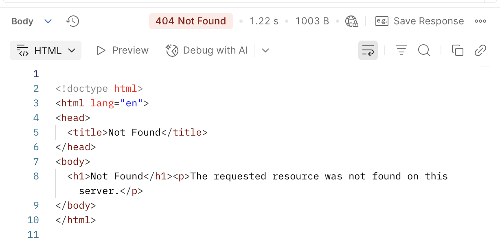
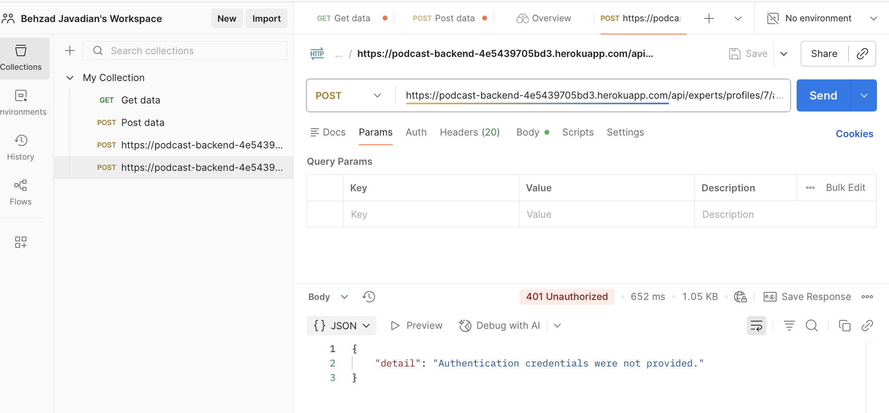

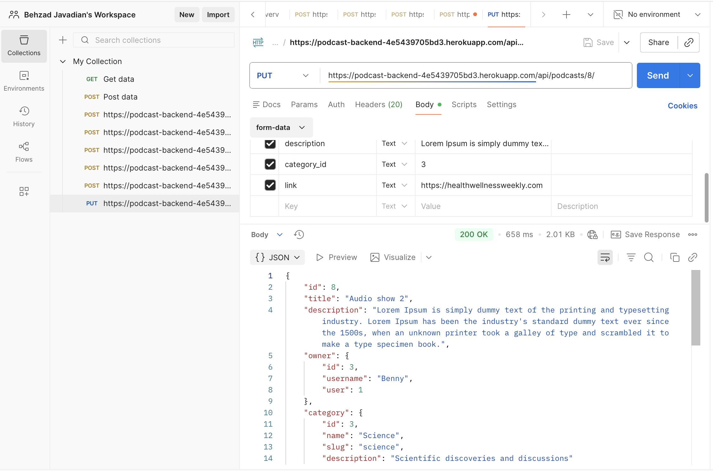
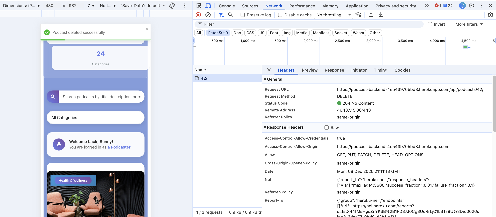
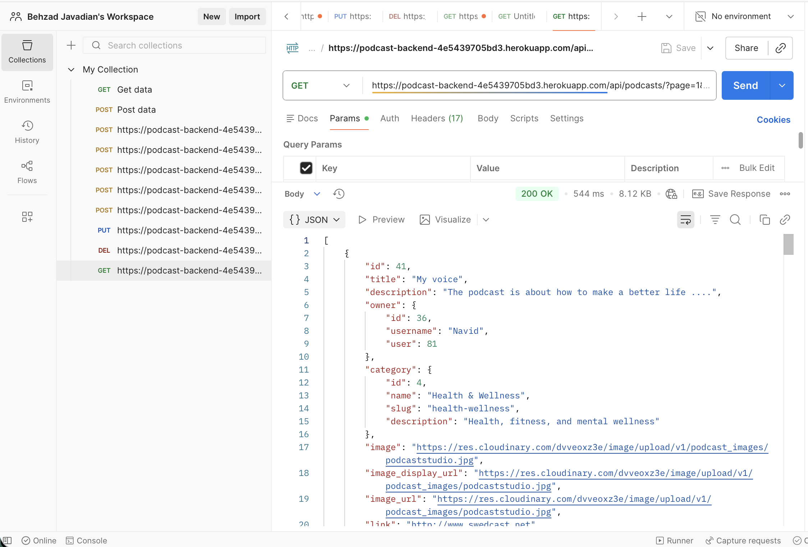

### Frontend Testing

- User can register and is redirected with a success message.
- User can log in and sees the updated navbar with user dropdown.
- Create podcast → toast notification + new item in the list.
- Update podcast → changes are visible immediately.
- Delete podcast → confirmation modal + removal from list.
- Search and category filter → display relevant podcasts.
- Expert profile create/edit → works with URL validation and toasts.
- Comments CRUD → create/edit/delete with inline validation and toasts.
- Messages → send via chat window and modal with success/error toasts.
- Responsive design → navbar and hamburger menu work correctly on mobile.
  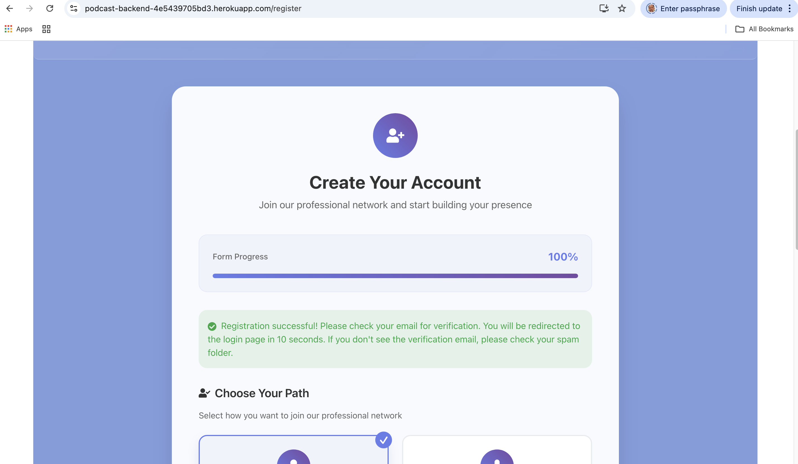
  
  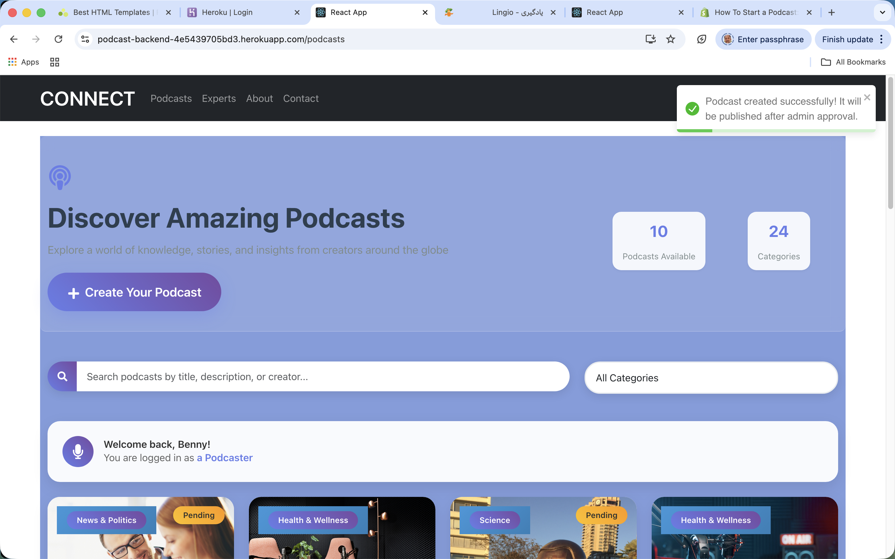
  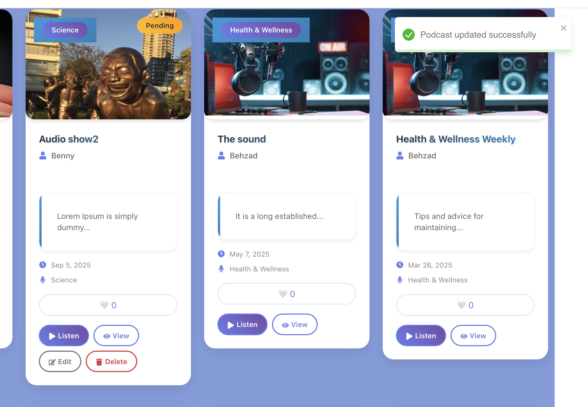
  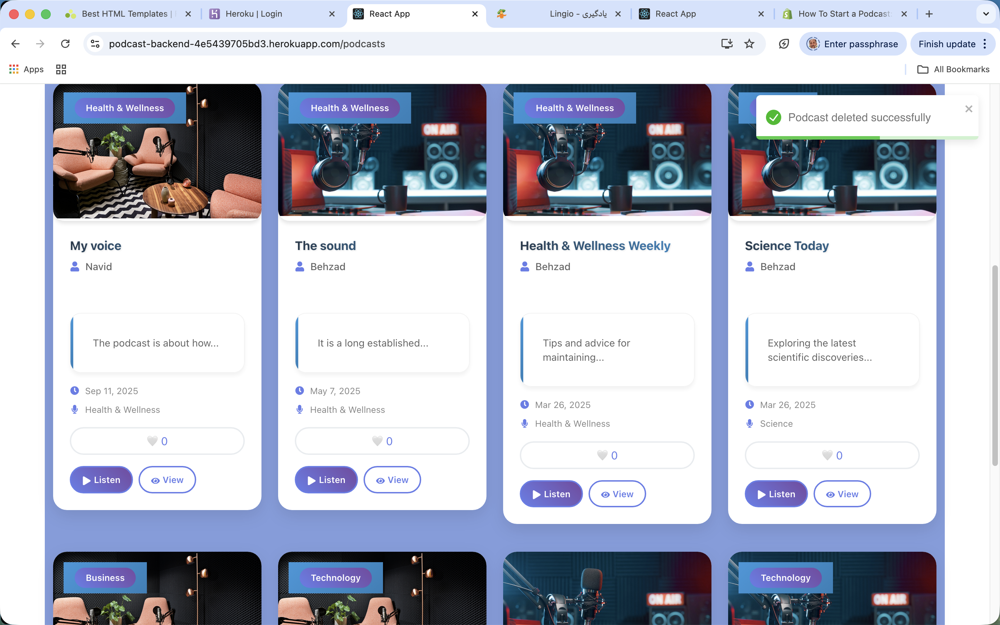
  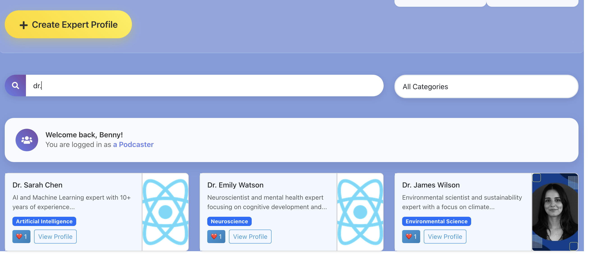
  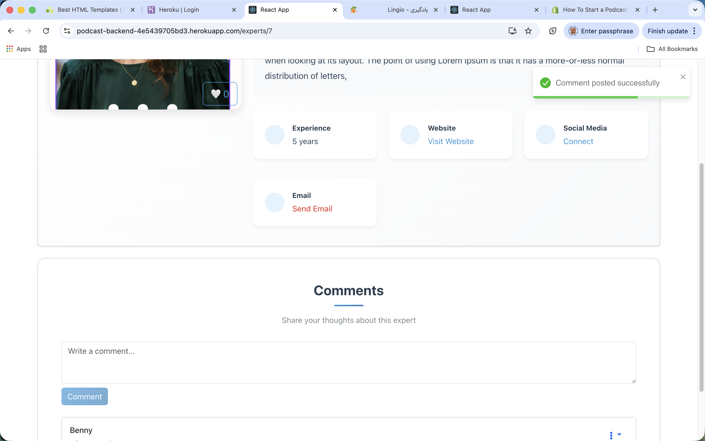
  !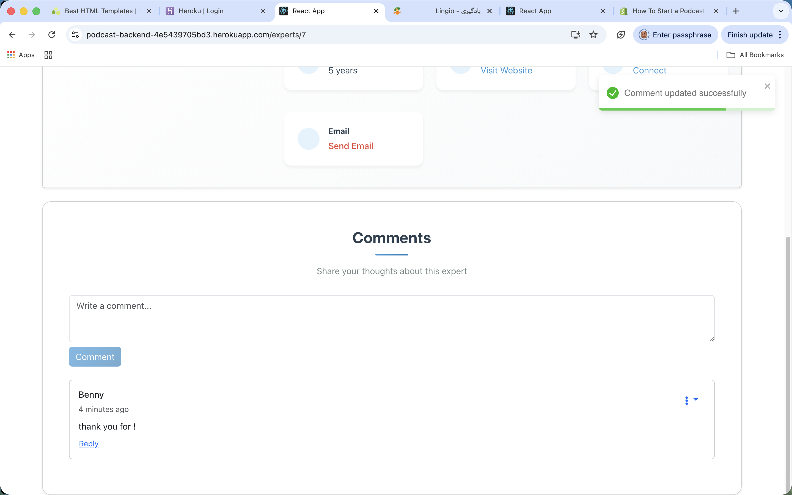
  
  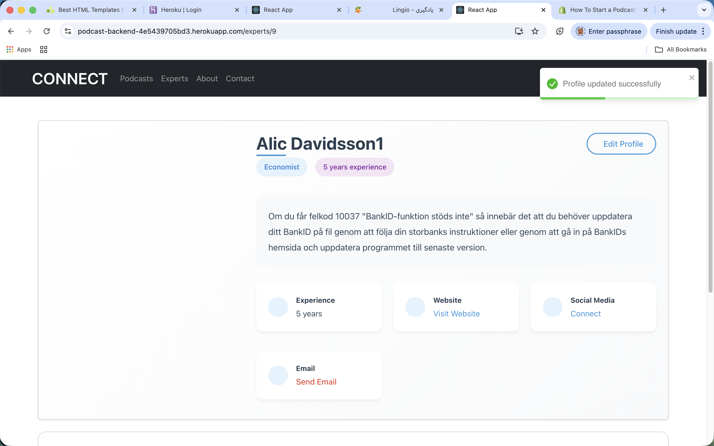

### API Testing (Postman, Browser, Django Admin)

To ensure that the REST API behaves correctly and that the React frontend consumes it reliably, the following tools and workflows were used.

#### Postman

Postman was used to:

- Test **authentication endpoints** (`/api/auth/register/`, `/api/auth/login/`, `/api/auth/logout/`) for:
  - Correct status codes (201 on register, 200 on login, 401 for invalid credentials).
  - Correct response payloads (JWT tokens, error messages).
- Test **CRUD endpoints** for podcasts, experts, comments and messages:
  - `GET`, `POST`, `PUT`, `DELETE` on `/api/podcasts/` and `/api/experts/`.
  - Validation errors (e.g. missing fields, invalid URLs).
- Verify **permission rules**:
  - Unauthenticated users receive `401` on protected endpoints.
  - Non-owners receive `403` when trying to update/delete other users’ content.

This confirms that the API contract is correct and matches the behaviour expected by the React frontend.

#### Browser & DevTools

In the browser (Chrome DevTools):

- Network tab was used to inspect all **Axios requests** from the React app:
  - Check request URLs, methods, headers (including JWT Authorization header), and payloads.
  - Confirm response status codes and JSON payloads.
- Verified that:
  - Form submissions send the correct data to the API.
  - Error responses (4xx/5xx) are correctly translated into **toast notifications** and inline error messages in the UI.
  - No full-page reload occurs; updates happen via React state.

This ensures that the **front-end interactivity is correctly wired** to the API and that users receive clear feedback.

#### Django Admin

Django Admin was used to:

- Confirm that data created through the React frontend is actually **persisted in the database**.
- Manually inspect podcasts, expert profiles, comments, likes and messages.
- Perform spot-checks when debugging permissions, validation rules, or unexpected API responses.

This provides an additional layer of verification on top of automated API tests.

---

#### Automation Status

Currently, the CONNECT platform does **not** have an automated test suite (unit tests or integration tests). All testing is performed manually through:

- Postman for API endpoint validation
- Browser DevTools for frontend-backend integration verification
- Django Admin for database persistence confirmation
- Manual UI testing for user flows and interactions

**Future improvements** include implementing automated unit and integration tests using:

- Django's test framework for backend API testing
- React Testing Library or Jest for frontend component testing
- Integration tests to verify end-to-end workflows

This will improve test coverage, reduce manual testing effort, and enable continuous integration workflows.

---

These testing activities demonstrate that:

- **LO3.7** – CRUD operations on persistent data are implemented and verifiable via the API.
- **LO3.10** – API endpoints have been systematically tested using Postman, the browser, and Django Admin.
- **LO4.4** – Errors are handled gracefully and surfaced to the user through clear UI messages.
- **LO4.5** – No major functional defects remain in the submitted version of the application.

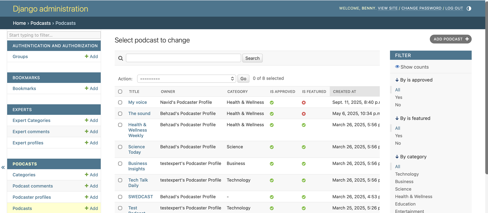
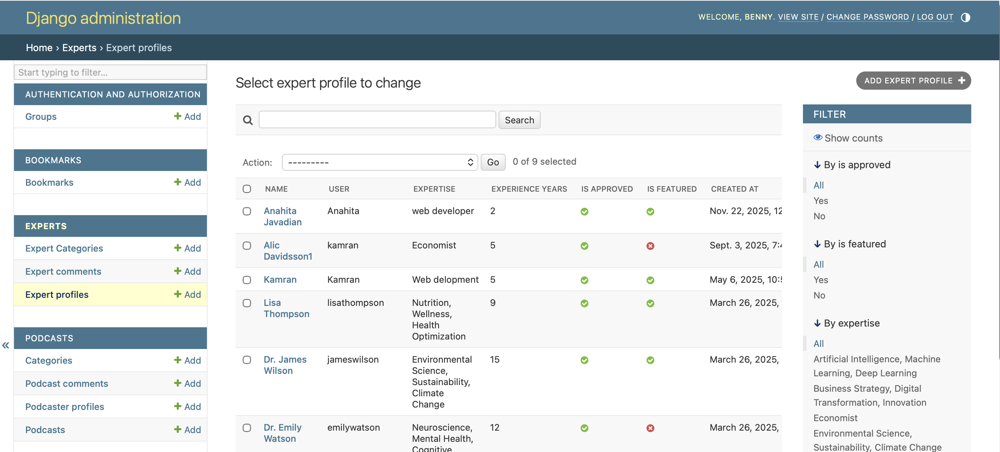
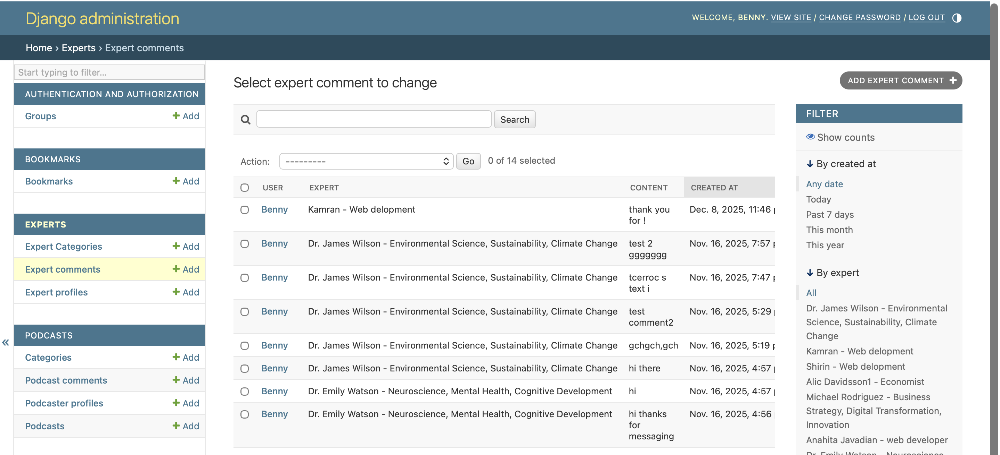
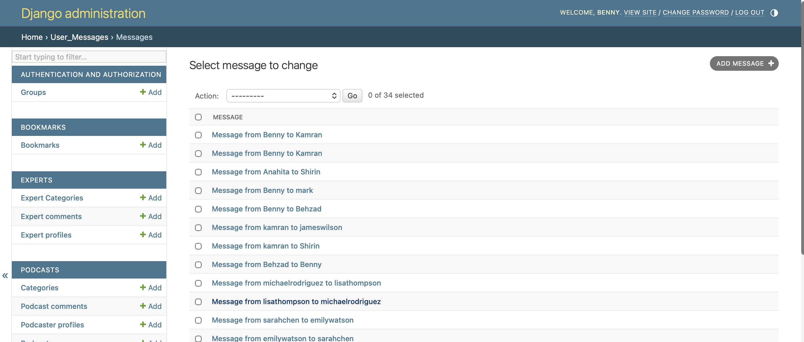

## Validator Testing

### Python (PEP8) — flake8

The project was validated using **flake8**.

No significant issues were found and the codebase meets PEP8 standards.

**Screenshot:**

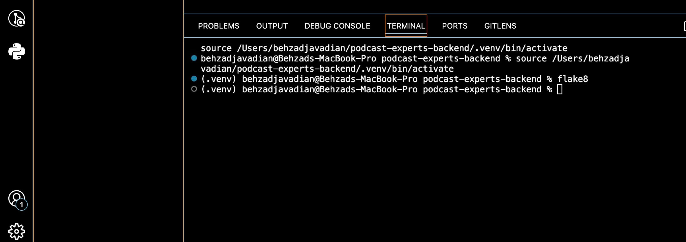

---

## Project Management (Agile)

This project followed an Agile-inspired workflow using GitHub Projects, GitHub Issues, and Milestones.  
All tasks, bugs, design decisions, and development progress were tracked visually through a Kanban board.

---

### Agile Documentation Links

- **GitHub Project Board:**  
  https://github.com/users/behzad17/projects/6
- **Milestones:**  
  https://github.com/behzad17/podcast-experts-backend/milestones
- **Issues:**  
  https://github.com/behzad17/podcast-experts-backend/issues
  Additional internal Agile documentation is available in:  
  `docs/agile/`

---

## Agile Board Screenshots

Below are screenshots demonstrating how Agile was used throughout development.

### Agile Board – Columns (ToDo → In Progress → In Review → Done)

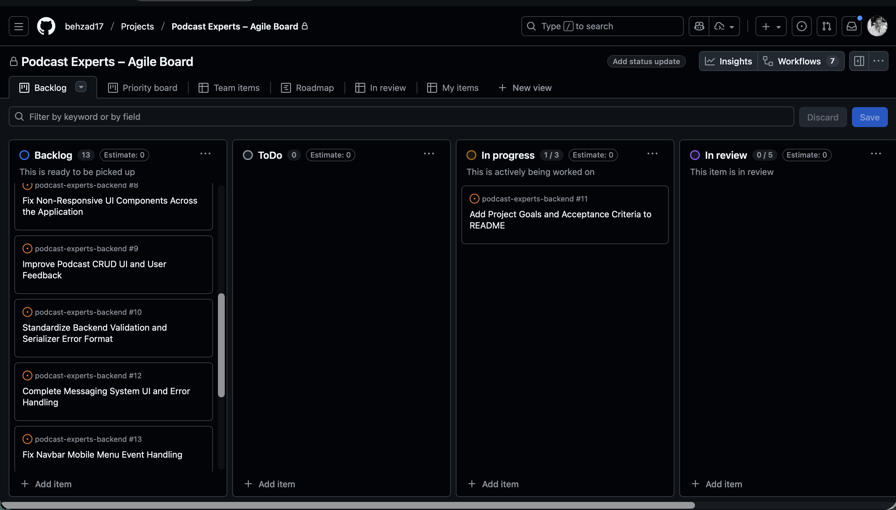

---

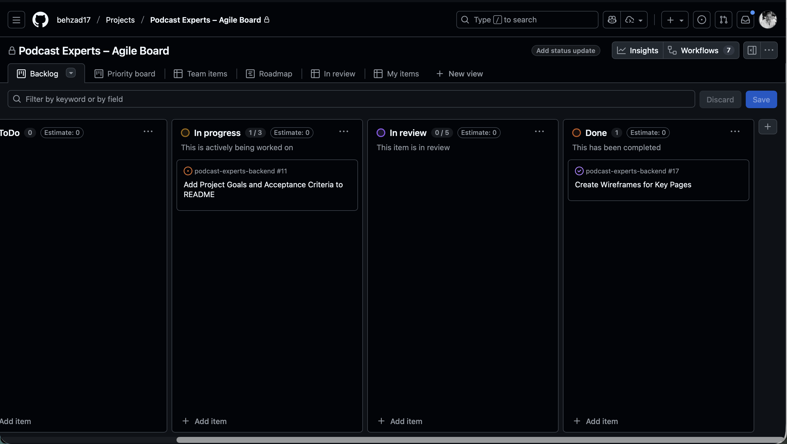

---

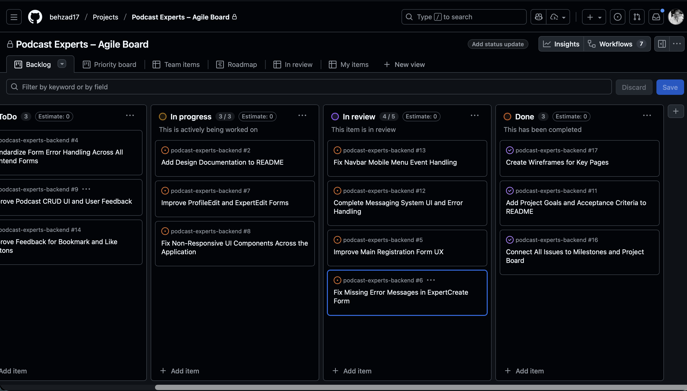

---

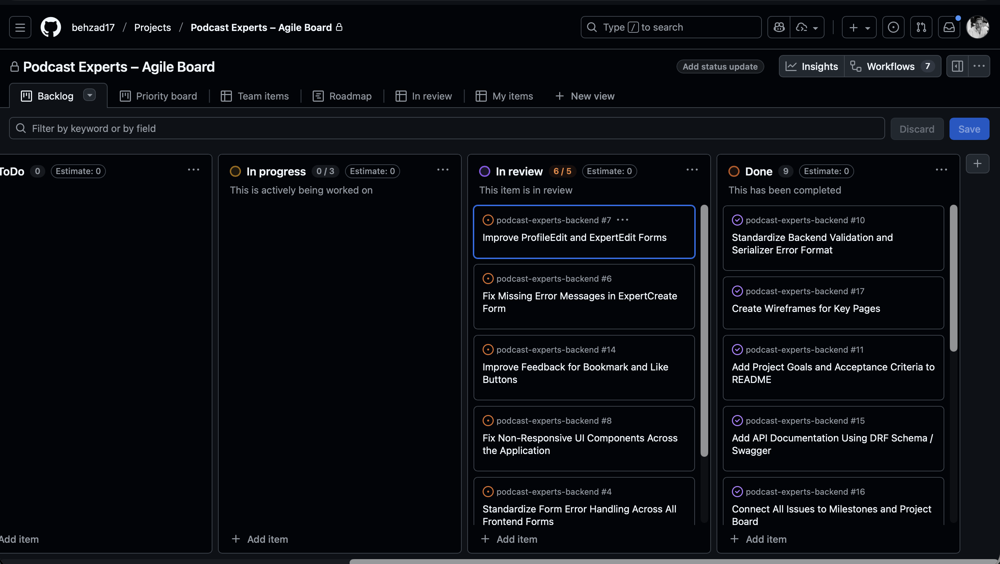

---

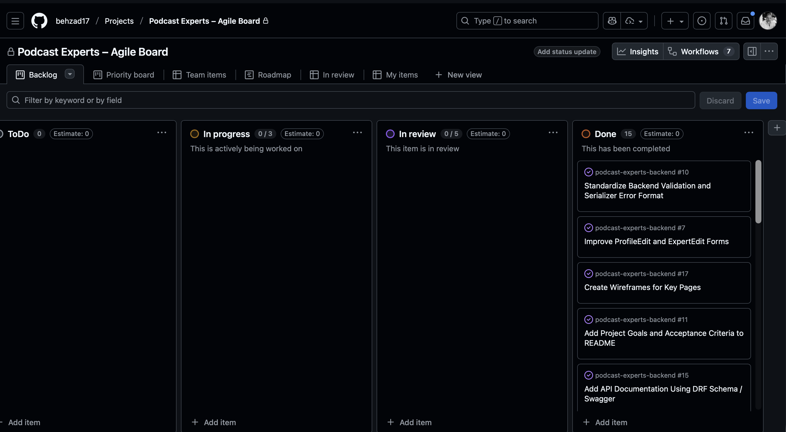

---

## 📌 How Agile Was Applied

- **GitHub Issues** were created for each feature, bug, or task
- **Milestones** represented major phases (Design, Core Features, UI Improvements, Documentation, etc.)
- **Kanban Board** visualised progress from:  
  **Backlog → To Do → In Progress → In Review → Done**
- Tasks were continuously updated and moved based on development progress
- All issues were assigned to milestones and linked to commits or pull requests

This structured approach ensured clear visibility of progress, traceability, and alignment with Code Institute’s Agile requirements.

# Future Improvements

Automated unit and integration tests
Advanced search and filtering (multi-field, tags)
Better handling for large audio uploads
Real-time notifications (WebSockets)
Analytics dashboard for podcasters and experts
Social media integrations and deep links
Podcast episode management
Expert verification / endorsement system

## 📞 Contact

- **Email:** info@bjcode.se
- **Website:** https://podcast-backend-4e5439705bd3.herokuapp.com/
- **Location:** Gothenburg , Sweden
- Support is also available via the Contact page.

# Acknowledgments

Django & Django REST Framework
React
Cloudinary
Bootstrap
Code Institute (project structure & assessment style)
All testers and contributors who helped improve the platform
